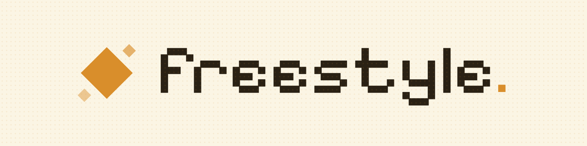
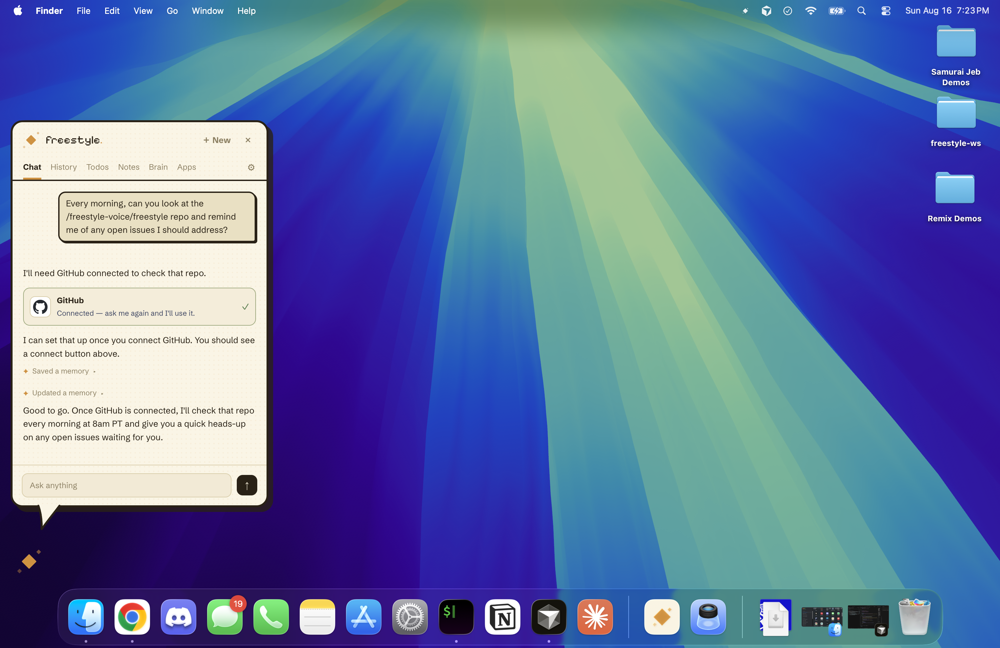

  

  
  
  
  
  

Freestyle is the AI assistant that lives on your desktop and makes sure you never forget an important thing again. Tell it what matters to you, connect the apps where that stuff lives, and it periodically checks on its own. When something needs you, it taps you on the shoulder: the invoice that is three weeks overdue, the pull request nobody has reviewed, the flight credit that expires Friday. Then it offers to do the next step, and waits for you to say yes.

It keeps notes and todos for you, remembers what you tell it, and can draft the reply, book the time, or start the task itself. Anything it wants to send, post, or buy is shown to you first and only happens when you press Allow.

### Features

- **Scheduled tasks** — "Every morning, look at my repo and tell me about open issues." "Tell me when a deal goes quiet for five days." Each one becomes a standing job that runs on a timer you set, and you get one desktop notification when something crosses the line, not a feed to scroll. Quiet hours keep it from pinging you at night.
- **Connected apps** — Gmail, Google Calendar, Slack, GitHub, Notion, Google Drive and Sheets out of the box, plus around 1,200 more tools through MCP. Connect an app once and Freestyle can read from it to check the things you asked about, and write to it only through an action you approve.
- **Todos and notes** — Freestyle tracks what you care about in a Todos list and plain-text notes. It reminds you when you are falling behind, verifies whether something actually got done, and checks items off for you when it sees they are finished.
- **Brain** — a memory of the things you have told it, kept as plain text you can read, edit, and delete. Say something once and it is there for every future conversation.
- **Approval before action** — sending an email, posting to Slack, booking time, buying something. Every one of these stops at an approval step showing exactly what would happen and where. You hit Allow, or you don't.
- **Dictation and Remix** — the writing tools are still here. Hold the hotkey, speak, release to paste polished text at your cursor, or highlight a paragraph and describe the change you want. Works in Google Docs, Slack, VS Code, Gmail, and anywhere else you type.

  

## Download

| Platform | Download |
|----------|----------|
| macOS (Apple Silicon) | [`.dmg`](https://github.com/freestyle-voice/freestyle/releases/latest) |
| macOS (Intel) | [`.dmg`](https://github.com/freestyle-voice/freestyle/releases/latest) |
| Windows | [`.exe`](https://github.com/freestyle-voice/freestyle/releases/latest) |
| Linux | [`.AppImage`](https://github.com/freestyle-voice/freestyle/releases/latest) / [`.deb`](https://github.com/freestyle-voice/freestyle/releases/latest) |

Mobile support on iOS and Android is coming soon. 

## Contributing

Contributions are welcome. See [CONTRIBUTING.md](CONTRIBUTING.md) for setup, local development, and opening up a PR. 

Consider joining our [Discord server](https://discord.gg/Fmgt5yZCDu)! That's where project contributors communicate.

## License

[MIT](LICENSE)