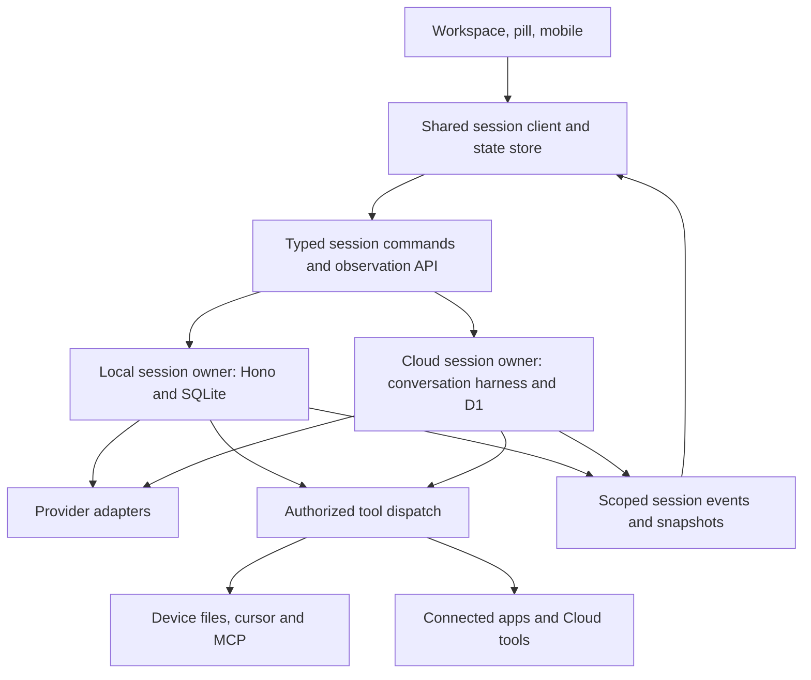

# Remix and OpenCode: features to adapt

Research snapshot: 10 September 2026. This is a source comparison and a proposed roadmap, not an implementation or a runtime benchmark.

The most valuable change is to make a Remix conversation a durable workspace with explicit inputs, decisions, progress, and deliverables. OpenCode provides strong interaction and session-management patterns for this. Remix should adapt those patterns to documents, research, connected apps, and recurring work.

**Sources inspected**

| Repository | Snapshot | Scope |
| --- | --- | --- |
| Freestyle | `76245a50e64b5ca6a0908c8565646ea637979f80`, `codex/remix-workspace-stability` | Electron workspace and pill, shared recovery, local Hono runtime, SQLite session store, contracts, related specs |
| Freestyle Cloud | `8b8d107911e9f0f04af55606ebc2cec50d83d39a`, `codex/whatsapp-remix` | Durable conversation harness, D1 turns/actions/history, connected tools, context management |
| OpenCode | [`859106eb17d5b840475f5e4b78e64c9622f8750e`](https://github.com/anomalyco/opencode/tree/859106eb17d5b840475f5e4b78e64c9622f8750e), default branch `dev` | Actual graphical app in `packages/app`, reusable `packages/session-ui`, established runtime in `packages/opencode`, newer `core/schema/protocol/server/client` packages |

These are the checked-out Freestyle branches, not a claim about released builds or production. Existing unrelated Cloud working-tree edits were left untouched. OpenCode contains established and evolving implementations side by side; the distinctions below matter.

**What Remix already has**

- Managed Cloud sessions with durable turn IDs, action claims, recovery, cancellation, desktop handoff, and queued follow-ups.
- Separate local-model sessions whose transcripts belong in local SQLite. Changing the configured model does not reclassify an existing session's ownership.
- Copy, edit in a new chat, and regenerate in a new chat in the full workspace.
- Grouped tool activity with expandable input/output, a Run inspector, Tasks, Notes, Brain, and a resizable inspector.
- Connected apps, local MCP integration, desktop document/cursor actions, voice entry, scheduled work, and notifications across the wider product.

These should be extended. They do not need to be proposed again as entirely new capabilities.

**Concrete gaps in the current implementation**

| Area | Remix evidence | Implication |
| --- | --- | --- |
| Runtime parity | [use-remix-recovery.ts](/Users/am/dev/freestyle-voice/freestyle/apps/electron/src/renderer/src/lib/use-remix-recovery.ts:39) returns a durable controller for remote sessions and a separate AI SDK Chat for local sessions; local recovery and queue methods are no-ops. | A feature added only to the Cloud lifecycle will behave differently with a local model. |
| Transcript retention | [remix-store.ts](/Users/am/dev/freestyle-voice/freestyle/apps/server/src/lib/remix-store.ts:11) retains the newest 40 local messages; snapshot saves delete rows outside that retained set. | Long local sessions lose older persisted history. Context limits and history retention need separate policies. |
| Composer | [panel.tsx](/Users/am/dev/freestyle-voice/freestyle/apps/electron/src/renderer/src/components/panel.tsx:2063) renders a textarea and send/stop controls. | The full desktop chat lacks OpenCode's structured file, resource, agent, and command entry surface. Cloud attachment infrastructure alone does not supply that UI. |
| Forks | [remix-recovery-controller.ts](/Users/am/dev/freestyle-voice/freestyle/apps/electron/src/renderer/src/lib/remix-recovery-controller.ts:641) copies the preceding messages into a new conversation when editing; [threads.ts](/Users/am/dev/freestyle-voice/freestyle/apps/electron/src/renderer/src/lib/threads.ts:5) has no lineage fields. | Preserve this safe behavior and add an explicit server fork operation, origin information, and branch navigation. |
| Steering | [remix-durable-queue.ts](/Users/am/dev/freestyle-voice/freestyle/apps/server/src/lib/remix-durable-queue.ts:168) prioritizes the selected queued message and cancels the active turn. | Current steering is an interruption. Safe-boundary steering is a distinct improvement. |
| Plans | [remix-tasks.ts](/Users/am/dev/freestyle-voice/freestyle/apps/electron/src/renderer/src/lib/remix-tasks.ts:1) reads checkboxes from global `todos.md`. | Personal tasks and an agent's plan for the current session need distinct records and UI. |
| Context | [compaction.ts](/Users/am/dev/freestyle-voice/cloud/apps/server/src/routes/v2/agent/compaction.ts:1) prunes/clamps/drops messages against a default 800,000-token estimate. | This is budget reduction, not a persistent semantic handoff summary based on the selected model's context window. |
| Observation | [remix-recovery-controller.ts](/Users/am/dev/freestyle-voice/freestyle/apps/electron/src/renderer/src/lib/remix-recovery-controller.ts:6) observes active durable turns on a one-second cadence; Cloud [getThread](/Users/am/dev/freestyle-voice/cloud/apps/server/src/utils/threads.ts:286) loads the full message set. | Typed deltas and paginated history would give a more scalable client contract. This is a code-based opportunity, not a measured latency finding. |

**Recommended feature list**

Priority means implementation order: P0 is the foundation/first product slice, P1 is the next expansion, P2 follows once those contracts are stable. Scope is relative engineering complexity, not a delivery estimate.

| # | Addition or improvement | Remix experience and implementation | Priority / scope |
| --- | --- | --- | --- |
| 1 | Structured context composer | Attach files and images, paste screenshots, and explicitly reference a Brain note, document selection, or connected-app resource. Show removable chips and previews. Introduce typed context references with source, version/capture time, and ownership; resolve them through the session's authorized runtime. Keep typed and spoken input in the same submission path. | P0 / large |
| 2 | Inline questions and decisions | Show single-choice, multi-choice, and free-text questions above the composer, including a visible waiting state and remembered draft answers. Add persisted question requests and idempotent replies to the existing durable action lifecycle. A response should resume the correct session after a reload. | P0 / medium |
| 3 | A live plan for each session | Show pending, working, completed, blocked, and canceled steps, with the current step easy to spot. Store structured session plan items linked to runs and outputs. Offer an explicit action to move a follow-up into personal Tasks rather than writing every execution step into `todos.md`. | P0 / medium |
| 4 | Consistent local and Cloud sessions | Give both runtimes the same send, stop, queue, question, approval, history, and event interfaces. Local execution stays owned by the local server; Cloud execution stays owned by the Cloud harness. Expose actual capabilities when a runtime cannot provide a tool. | P0 / large |
| 5 | Complete history and useful compaction | Retain full transcripts independently of model input. Build a model-specific context view using recent turns plus a persisted summary of goals, decisions, unresolved work, sources, and tool effects. Show a compaction marker with an inspectable summary; allow manual compaction. | P0 / large |
| 6 | An outputs and review workspace | Adapt OpenCode's file/review panel into tabs for a research report, draft email, document, spreadsheet, or generated image. Outputs need stable IDs, versions, provenance, and links back to the producing turn. Start with Markdown reports and email drafts; add format-specific editing later. | P1 / large |
| 7 | Rich action review and scoped permissions | Present the exact action, target account/resource, and proposed changes. Offer once-only approval, denial with feedback, and explicit narrow grants where appropriate. Unify the UI across local, MCP, and connector actions while keeping authorization at each execution boundary. Preserve full-command acknowledgement for Bash. | P1 / large |
| 8 | Research, Draft, and Act modes | Adapt OpenCode's agent profiles and Plan/Build separation to coworking. Research reads; Draft creates reviewable outputs; Act can execute authorized external changes. Profiles select instructions, tool capabilities, and optional model settings. Enforce mode restrictions in the tool broker, including delegated work. | P1 / medium-large |
| 9 | Explicit conversation branches | Add “Branch from here,” source-message links, and parent/branch navigation. Persist `parentSessionId` and `forkMessageId`, and provide an atomic fork API. Branches inherit conversational context but never re-run old actions or inherit pending execution claims. Make local and Cloud edit/regenerate behavior consistent. | P1 / medium |
| 10 | Model controls and context visibility in chat | Show the current model/runtime, context use, and available capabilities in the composer or inspector. Support switching compatible models at a turn boundary and record the change in history. Moving a local transcript to Cloud must be a separate explicit transfer. Display provider costs separately from Freestyle credits. | P1 / medium |
| 11 | Distinct Queue, Steer, and Stop controls | Queue runs after the current work; Steer adds a correction at the next safe model boundary; Stop cancels. Put admitted inputs in the session owner's durable inbox, with immutable request IDs and conflict checks. Synchronize the queue across observers. Retain existing queue editing/removal. | P1 / large |
| 12 | Better tool-result cards | Build specialized renderers for web sources, connector entities, document changes, downloads, and errors. Keep the existing grouped activity summary, but expose useful results before raw JSON. Add renderer metadata to tool definitions and a safe generic fallback. | P1 / medium |
| 13 | Searchable, organized session navigation | Add session search, archive, favorites, and filters for running, waiting on me, and finished. Adapt OpenCode's project grouping into coworking projects with selected documents and instructions. Extend existing activity/unread behavior and the Attention surface rather than building a second notification system. | P1 / medium-large |
| 14 | Reusable workflows and commands | Add discoverable commands such as `/meeting-prep`, `/research`, and `/weekly-review`, with saved instructions, required inputs, allowed tools, and output expectations. Start as parameterized workflows and instruction bundles. Integrate useful workflows with the existing scheduler. | P1 / medium |
| 15 | Specialist child sessions | Let Remix delegate bounded research or drafting work and show child-session progress/results under the parent. Add parent-child relationships, concurrency and cost budgets, cancellation propagation, and permission inheritance. Begin with read-only specialists and explicit orchestration. | P2 / large |
| 16 | Long-session rendering and navigation | Add paginated history, stable message/part IDs, selective updates, and virtualization when message counts warrant it. Preserve scroll anchors, drafts, and expanded cards across session switches. Use measured profiling to decide whether Markdown parsing should move to a worker. | P1 / medium-large |
| 17 | Export and controlled sharing | Export a human-readable transcript plus structured session data and selected artifacts. If sharing is added, share an explicit snapshot with chosen content and access controls. OpenCode's JSON export is a useful base pattern; coworking-friendly export and controlled sharing are adaptations. | P2 / medium |
| 18 | Clear completion and budget outcomes | Distinguish completed work, waiting for an answer, waiting for a device, provider failure, cancellation, and reaching a budget/step limit. Show what was delivered and what remains. Connect those states to existing notifications, with deduplication and links to the relevant session. | P1 / medium |

**OpenCode evidence for these recommendations**

All links below are pinned to the inspected commit. Proposed coworking extensions are not claims that OpenCode implements those exact product features.

| Pattern | Source |
| --- | --- |
| Structured files, agent references, selected ranges, and context comments | [build-request-parts.ts](https://github.com/anomalyco/opencode/blob/859106eb17d5b840475f5e4b78e64c9622f8750e/packages/app/src/components/prompt-input/build-request-parts.ts), [slash-popover.tsx](https://github.com/anomalyco/opencode/blob/859106eb17d5b840475f5e4b78e64c9622f8750e/packages/app/src/components/prompt-input/slash-popover.tsx) |
| Choice/free-text questions and permission controls | [session-question-dock.tsx](https://github.com/anomalyco/opencode/blob/859106eb17d5b840475f5e4b78e64c9622f8750e/packages/app/src/pages/session/composer/session-question-dock.tsx), [session-composer-state.ts](https://github.com/anomalyco/opencode/blob/859106eb17d5b840475f5e4b78e64c9622f8750e/packages/app/src/pages/session/composer/session-composer-state.ts), [permission.ts](https://github.com/anomalyco/opencode/blob/859106eb17d5b840475f5e4b78e64c9622f8750e/packages/core/src/permission.ts) |
| Session todo state and composer dock | [session-todo.ts](https://github.com/anomalyco/opencode/blob/859106eb17d5b840475f5e4b78e64c9622f8750e/packages/schema/src/session-todo.ts), [session-todo-dock.tsx](https://github.com/anomalyco/opencode/blob/859106eb17d5b840475f5e4b78e64c9622f8750e/packages/app/src/pages/session/composer/session-todo-dock.tsx) |
| Plan/Build profiles and delegated sessions | [agent.ts](https://github.com/anomalyco/opencode/blob/859106eb17d5b840475f5e4b78e64c9622f8750e/packages/opencode/src/agent/agent.ts), [task.ts](https://github.com/anomalyco/opencode/blob/859106eb17d5b840475f5e4b78e64c9622f8750e/packages/opencode/src/tool/task.ts) |
| File review and specialized message parts | [review-panel-v2.tsx](https://github.com/anomalyco/opencode/blob/859106eb17d5b840475f5e4b78e64c9622f8750e/packages/app/src/pages/session/v2/review-panel-v2.tsx), [message-part.tsx](https://github.com/anomalyco/opencode/blob/859106eb17d5b840475f5e4b78e64c9622f8750e/packages/session-ui/src/components/message-part.tsx) |
| Fork from a selected message and filesystem revert | [dialog-fork.tsx](https://github.com/anomalyco/opencode/blob/859106eb17d5b840475f5e4b78e64c9622f8750e/packages/app/src/components/dialog-fork.tsx), [session.ts](https://github.com/anomalyco/opencode/blob/859106eb17d5b840475f5e4b78e64c9622f8750e/packages/opencode/src/session/session.ts), [revert.ts](https://github.com/anomalyco/opencode/blob/859106eb17d5b840475f5e4b78e64c9622f8750e/packages/opencode/src/session/revert.ts) |
| Context metrics, semantic summaries, and retained recent turns | [session-context-metrics.ts](https://github.com/anomalyco/opencode/blob/859106eb17d5b840475f5e4b78e64c9622f8750e/packages/app/src/components/session/session-context-metrics.ts), [compaction.ts](https://github.com/anomalyco/opencode/blob/859106eb17d5b840475f5e4b78e64c9622f8750e/packages/opencode/src/session/compaction.ts) |
| Typed session records, durable input admission, and safe input promotion | [session-message.ts](https://github.com/anomalyco/opencode/blob/859106eb17d5b840475f5e4b78e64c9622f8750e/packages/schema/src/session-message.ts), [input.ts](https://github.com/anomalyco/opencode/blob/859106eb17d5b840475f5e4b78e64c9622f8750e/packages/core/src/session/input.ts), [run-coordinator.ts](https://github.com/anomalyco/opencode/blob/859106eb17d5b840475f5e4b78e64c9622f8750e/packages/core/src/session/run-coordinator.ts) |
| Durable event sequencing and client state updates | [event.ts](https://github.com/anomalyco/opencode/blob/859106eb17d5b840475f5e4b78e64c9622f8750e/packages/core/src/event.ts), [event-reducer.ts](https://github.com/anomalyco/opencode/blob/859106eb17d5b840475f5e4b78e64c9622f8750e/packages/app/src/context/global-sync/event-reducer.ts) |
| Virtualized timeline, archive/export commands, notifications | [message-timeline.tsx](https://github.com/anomalyco/opencode/blob/859106eb17d5b840475f5e4b78e64c9622f8750e/packages/app/src/pages/session/timeline/message-timeline.tsx), [use-session-commands.tsx](https://github.com/anomalyco/opencode/blob/859106eb17d5b840475f5e4b78e64c9622f8750e/packages/app/src/pages/session/use-session-commands.tsx), [session-export.ts](https://github.com/anomalyco/opencode/blob/859106eb17d5b840475f5e4b78e64c9622f8750e/packages/app/src/utils/session-export.ts), [notification.tsx](https://github.com/anomalyco/opencode/blob/859106eb17d5b840475f5e4b78e64c9622f8750e/packages/app/src/context/notification.tsx) |

**Architecture to implement in Remix**

Keep React/Electron, the local Hono boundary, Cloudflare, and AI SDK provider integration. Introduce a product-owned session model above provider-specific messages. OpenCode's Solid UI and Effect/Bun runtime are useful references; copying them wholesale would add a second framework/runtime without directly delivering the desired coworking features.

The broker represents a shared contract, not one process with every credential. Local operations still execute on the selected device, and Cloud tools still execute under their authenticated Cloud account.

Use the following explicit records:

- `Session`: owner/runtime, model/profile, title, project, parent/fork reference, capability set.
- `Input`: immutable request ID, typed prompt/context references, delivery mode, admission and promotion state.
- `Run` and `MessagePart`: durable lifecycle plus typed text, tool, question, plan, and output references.
- `ActionRequest`: exact target/input, approval policy, claim, outcome, execution receipt, and reconciliation state.
- `ContextCheckpoint`: a summary and the history boundary it covers; original messages remain available.
- `Artifact`: owner, MIME type, versions, source turn, preview/download/edit metadata.
- `SessionEvent`: scoped sequence and schema version for committed product changes; transient token deltas may be batched separately.

Clients should send a new input, reply, or command to the owner and render its state. They should not need to resubmit an authoritative full transcript for every operation. Provide snapshots plus events, with a resynchronization path for missed or expired cursors. Commit important state transitions and their events together. Generate clients from one versioned contract rather than continuing byte-for-byte schema mirroring across repositories.

Cloud already has a substantial part of this: [ConversationHarness](/Users/am/dev/freestyle-voice/cloud/apps/server/src/durable-turns/harness.ts:132) owns turn serialization/recovery, and [store.ts](/Users/am/dev/freestyle-voice/cloud/apps/server/src/durable-turns/store.ts:1) persists action and turn state. Extend that infrastructure. A rewrite should not remove action deduplication, account ownership checks, cancellation receipts, or controlled Resume behavior.

**Breaking changes worth making**

1. Introduce one versioned session contract used by all new Remix surfaces. Consolidate direct-stream, durable-turn, and local-session client behavior behind adapters.
2. Move execution state and authoritative message mutation out of renderer-specific paths. The runtime owner persists progress before publishing it.
3. Replace the local 40-message retention policy with full persisted history and paginated retrieval. Keep model context budgeting separate.
4. Make structured context, questions, plans, outputs, and lineage real data rather than conventions inferred from Markdown or arbitrary tool JSON.
5. Give tool definitions explicit execution location, effect type, permission requirements, display metadata, and retry/reconciliation behavior.

Migrate existing sessions with their ownership intact. Known retained messages can be imported; previously deleted local history cannot be reconstructed. Existing Cloud and local session IDs should stay resolvable. Retire compatibility paths after the corresponding clients have migrated; compatibility is a rollout decision rather than a permanent reason to duplicate architecture.

**Where copying OpenCode directly would be a mistake**

- OpenCode's newer V2 API currently exposes `compact` and `wait` methods that return `OperationUnavailableError`: [core/session.ts](https://github.com/anomalyco/opencode/blob/859106eb17d5b840475f5e4b78e64c9622f8750e/packages/core/src/session.ts#L417). Use the established compaction implementation as the working reference.
- V2 execution coordination is process-local: [execution/local.ts](https://github.com/anomalyco/opencode/blob/859106eb17d5b840475f5e4b78e64c9622f8750e/packages/core/src/session/execution/local.ts). Durable input/event storage does not by itself supply clustered execution or automatic crash recovery. Remix's Cloud harness is already more directly suited to its hosted-session requirements.
- OpenCode V2 pending questions and approvals use in-memory maps/deferreds: [question.ts](https://github.com/anomalyco/opencode/blob/859106eb17d5b840475f5e4b78e64c9622f8750e/packages/core/src/question.ts), [permission.ts](https://github.com/anomalyco/opencode/blob/859106eb17d5b840475f5e4b78e64c9622f8750e/packages/core/src/permission.ts). Copy the interaction, but use Remix's durable records for sessions that must survive process/device interruption.
- Background subagents are gated by `OPENCODE_EXPERIMENTAL_BACKGROUND_SUBAGENTS` in the inspected implementation. Foreground child sessions are the clearer initial reference.
- Git snapshots can undo filesystem changes. A coworking agent cannot universally undo a sent email, a booking, or a third-party mutation. Revert a draft through artifact versions; reverse an external action only when the provider offers a concrete compensating operation. Conversation branching alone changes no external state.
- Terminal panes, LSP integration, Git worktrees, and repository-first navigation are secondary for Remix. Translate project context into documents, sources, account connections, and work goals.

**Suggested delivery sequence**

1. **Foundation:** define the shared contract, retain full local history, unify local/Cloud lifecycle interfaces, and add typed events with a snapshot fallback. Preserve the current UI while doing this.
2. **First user-visible slice:** ship context attachments, inline questions, and a session plan together. A user can attach a brief, answer scope questions, and watch the work progress. Include a basic Markdown output preview if it fits the slice.
3. **Review and control:** add artifact versions, richer action previews, Research/Draft/Act modes, explicit branching, model controls, and true safe-boundary steering.
4. **Scale the workflow:** add reusable commands, organized/searchable sessions, long-history rendering, specialists, and exports. Integrate the existing scheduler and notification system throughout.

Validate the contract with a few meaningful scenarios: reload during a question; attach two observers to one session without duplicate tool execution; interrupt during an external action with an uncertain result; queue and steer at a model boundary; switch local models without changing ownership; retain and reopen a long local session; fork without repeating historical side effects. Benchmark large timelines separately before claiming a performance improvement.
